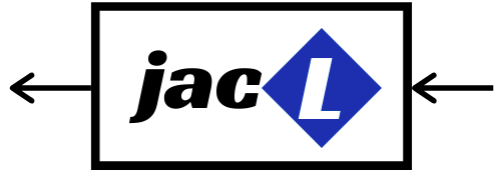

# Just Another Control Library


Nothing to be described, JACL only an ordinary control library as in general. At first this library was made for personal use only, hence continuous development must exist due to only several methods available that related to author work in capstone project called MICRON.

## Installation
Clone the repository first.
```console
$ git clone https://github.com/koseng-lc/jacl.git
```
Create the build environment.
```console
$ cd jacl
$ mkdir build
$ cd build
$ cmake ..
$ make -j(number_of_cores)
$ sudo make install
```
## Linking
You can easily set the JACL CMake config directory then use ```find_package``` features.
```cmake
set(jacl_DIR ...)
find_package(jacl REQUIRED)
target_link_libraries(your_target jacl_lib)
```

## Dependencies
* Boost
* Armadillo
* Scipy
* Matplotlib
* Qt (for example)
